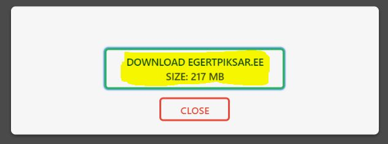
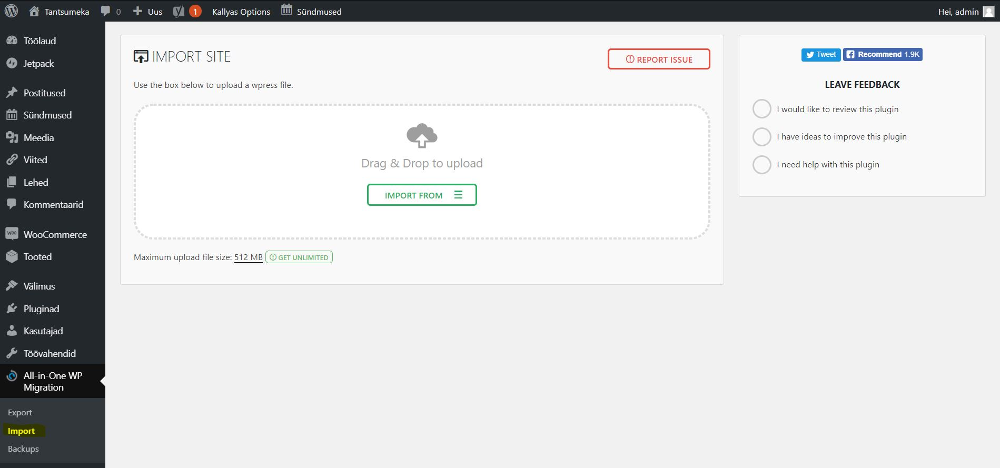

## Tantsumeka

# Pilt avalehest

# Eesmärk
Luua Tantsumekale uus ja tänapäevane veebileht, mis toimiks ka nutiseadmetes. Klient soovis lehele uut disaini, poodi, foorumit ning registreerimisvormi.

# Projekt tehti suveprojekti raames Tallinna Ülikoolis

# Kasutatud tehnoloogiad
Zone-i virtuaalserver,
Wordpress Versioon 4.9.6,
Adobe Photoshop,
Adobe Illustrator,
Cyberlink PowerDirector

# Grupi liikmed
Riho Noormets, Egert Piksar, Kert Tamm, Kevin Kodasma, Egert Klaamas

# Paigaldusjuhised
NB: Zone.ee-s on võimalus ühendust võtta info@zone.ee ning mõlema domeeni halduri nõusolekul on võimalus tõsta leht üle teisele domeenile zone.ee poolt. 

Wordpressi failide/lehe tõstmine teise serverisse

1.	Mine lehele, kus antud leht üleval on, logige domeen.ee/wp-admin-ina sisse, sisestage kasutajanimi ja parool.
2.	Valige menüüst „Pluginad“ ja seejärel „Lisa uus“.

3.	Sisestage võtmesõna „All in one wp migration“ ja paigaldage  ja lülitage sisse pildil näidatud.vasakpoolne plugin.  

4.	Vajutage menüüs alla laetud plugina peale, seejärel „Export to“ ja valige „file“.  

5.	Nüüd näitab plugin ära, kui suur on teie wp sisu, mille saate siis alla laadida rohelisele kastikesele vajutades, soovi korras saab ka „akna“ sulgeda ja proovida teisi exportimis valikuid.

6.	Laadige alla teise serverisse Wordpress, Install.
7.	Uploadige alla laetud fail lahti pakitult serverisse.
8.	Minge domeenile ja lisage andmebaasi andmed, kui andmebaas on juba tehtud(kui ei, siis minge oma serveri phpmyadmin-i ja tehke uus andmebaas(nt: if17_Tantsumeka) 

9.	Vajutage „Sumbit“, saate koodi, mille peate kopeerima.
10.	Minge oma serveris kausta, kus on wp-config-sample.php ja avage see fail.
11.	„Kleepige“ sinna kogu kopeeritud sisu.
12.	Salvestage fail wp-config.php-na
13.	Minge tagasi lehele, kust saite koodi, tehke lehele „refresh“. Sisestage saidi nimi, wp-adminis küsitav kasutajanimi, parool ja e-mail. Vajutage „Install Wordpress“ 

14.	Logige sisse sisestatud kasutajaandmetega.
15.	Tehke uuesti läbi punkt 2 ja 3.
16.	Vajutage menüüs alla laetud plugina peale, seejärel „Import“ ja lohistage varem exporditud fail vastavasse kastikesse. 

