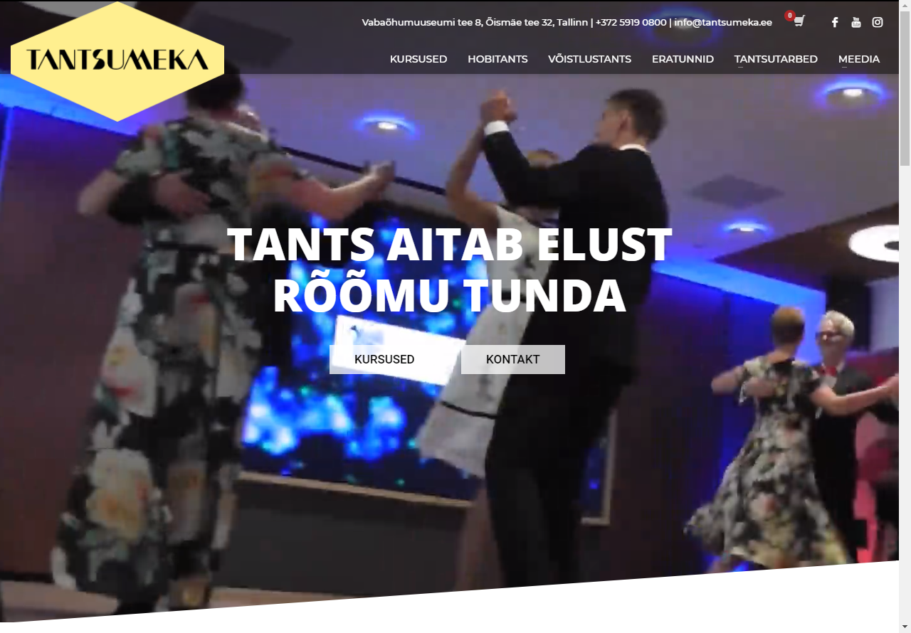

## Tantsumeka

# Pilt avalehest


# Eesmärk
Luua Tantsumekale uus ja tänapäevane veebileht, mis toimiks ka nutiseadmetes. Klient soovis lehele uut disaini, poodi, foorumit ning registreerimisvormi.

# Projekt tehti suveprojekti raames Tallinna Ülikoolis

# Kasutatud tehnoloogiad
Zone-i virtuaalserver
Wordpress Versioon 4.9.6
Adobe Photoshop
Adobe Illustrator
Cyberlink PowerDirector

# Grupi liikmed
Riho Noormets, Egert Piksar, Kert Tamm, Kevin Kodasma, Egert Klaamas

# Muudetud kood


```
<a style="color: blue;" href="https://egertpiksar.ee/tantsutarbed/tantsukingad/jalamoodud/">Mõõtmise juhend</a>
```

Pildil on koht, kus me koodi muutsime
Muutsime koodi wordpressi kaudu ning lisasime lingi ja muutsime selle värvi siniseks. Eelnevalt ei muutnud plugin linki siniseks, seega tegime seda ise.

# Paigaldusjuhised
NB: Zone.ee-s on võimalus ühendust võtta info@zone.ee ning mõlema domeeni halduri nõusolekul on võimalus tõsta leht üle teisele domeenile zone.ee poolt. 

1. Minge FTP kaudu serverisse, kus leht üleval on   
2. Minge kausta public_html   
3. Laadige alla kaust, mis on seotud wordpressi lehega.  
4. Eksportige Wordpressi andmebaas 
5. Looge andmebaas uude domeeni
6. Uuendage wp-config.php andmeid
6.1 Muutke andmebaasi nime   

```
define('DB_NAME', 'db_name');
```  
db_name tuleb asendada uue andmebaasi nimega


6.2 Muutke kasutajanime

```
define('DB_USER', 'db_user');
```  
db_user tuleb asendada uue andmebaasi kasutajanimega
6.3 Muutke parool
```
define('DB_PASSWORD', 'db_pass');
```  
db_pass tuleb asendada uue andmebaasi parooliga

7. Importige andmebaas
8. Laadige üles kaust, mis on seotud wordpressi lehega uuele domeenile.
